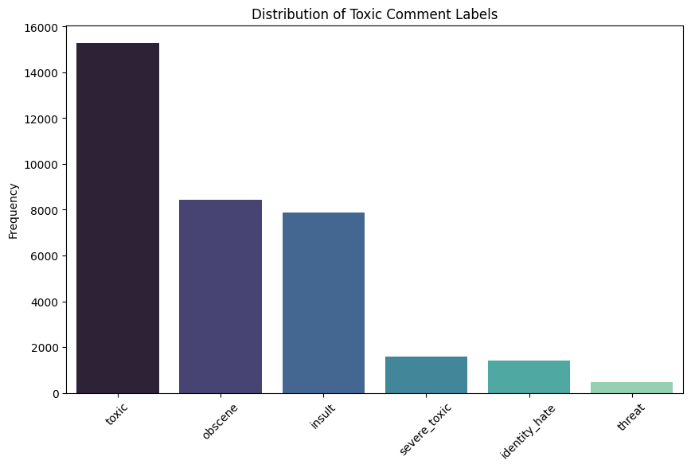
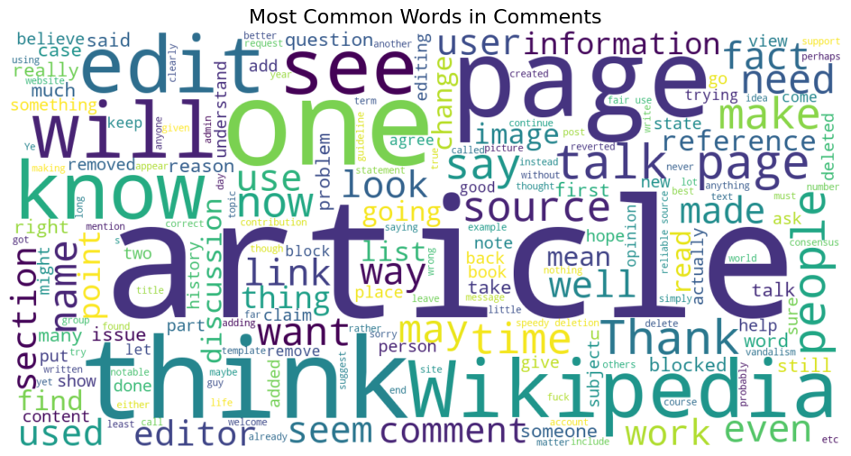

# Toxic Comment Classification - Multi-Label NLP Project

##  Project Overview
This project implements a multi-label classification system to detect various types of toxicity in Wikipedia talk page comments. The labels for toxicity include:

- toxic
- severe_toxic
- obscene
- threat
- insult
- identity_hate

I use Natural Language Processing (NLP) techniques and traditional machine learning algorithms to preprocess, vectorize, and classify the comments into one or more of these categories.

---

---

## File Structure

```bash
toxic-comment-classification/
│
├── main.ipynb
├── README.md 
├── requirements.txt  
├── images/  
    ├── class_dist.png 
    ├── wordcloud.png 
    └── correlation.png 
```

---

## Dataset
The dataset is provided by the Jigsaw Toxic Comment Classification Challenge hosted on Kaggle:
**Source:** [Jigsaw Toxic Comment Dataset](https://www.kaggle.com/competitions/jigsaw-toxic-comment-classification-challenge/data?select=train.csv.zip)  
The dataset contains over 150,000 Wikipedia comments labeled across 6 categories.

---

## Technologies & Tools
- Python
- Jupyter Notebook
- Scikit-learn
- Pandas, NumPy
- Matplotlib, Seaborn
- WordCloud
- TF-IDF Vectorization

---

## Key Features
Multi-label classification (each comment can have multiple toxic tags)

Advanced data visualization:
    - Class distribution bar plot
    - Label correlation heatmap
    - Word cloud of toxic comments

Model Training:
    - Logistic Regression
    - Random Forest Classifier

Model Evaluation using classification report (precision, recall, F1-score)

---

## Preprocessing
The following preprocessing steps were applied:
- Lowercasing all text
- Removing special characters, punctuation, and digits
- Removing stopwords using NLTK
- Tokenization and stemming using SnowballStemmer
- Vectorization using TF-IDF (Term Frequency-Inverse Document Frequency)

---

## Modeling
The project trains and evaluates the following classifiers:
    - Logistic Regression
    - Naive Bayes
    - Random Forest

All models are wrapped using OneVsRestClassifier for multi-label classification.

---

## 📈 Sample Visualizations
| Class Distribution | Word Cloud |
|--------------------|------------|
|  |  |

---

## Evaluation
The performance is measured using:
    - Accuracy
    - F1-Score (macro & micro)
    - ROC AUC Score

Classification reports are generated for each model to assess performance across all six labels.

---

## Results
- Logistic Regression with TF-IDF features yielded the best overall performance.

- Naive Bayes was efficient but slightly less accurate on minority labels like threat and identity_hate.

- Word clouds and frequency distributions provided useful insights during EDA.

## How to Run

1. **Clone the repo**
```bash
git clone https://github.com/your-username/toxic-comment-classification.git
cd toxic-comment-classification
```

2. **Install dependencies**
```bash
pip install -r requirements.txt
```

3. **Launch the notebook**
```bash
jupyter notebook Toxic_Comment_Classification_With_RandomForest.ipynb
```

---

## License
This project is licensed under the MIT License.
You are free to use, modify, and share this work with proper attribution.

See the [LICENSE](LICENSE) file for more details.
